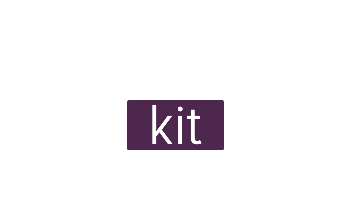

[**WIP**] A free [as in freedom](https://www.gnu.org/philosophy/free-sw.en.html) re-implementation of Gimkit with a frontend written in Astro/Svelte and a backend written in TypeScript as well as Go.

(a cool gimkit client for cool gimkit gamers)

## Usage

We are planning to make pre-built releases eventually, but until then you'll need to compile it from source.
